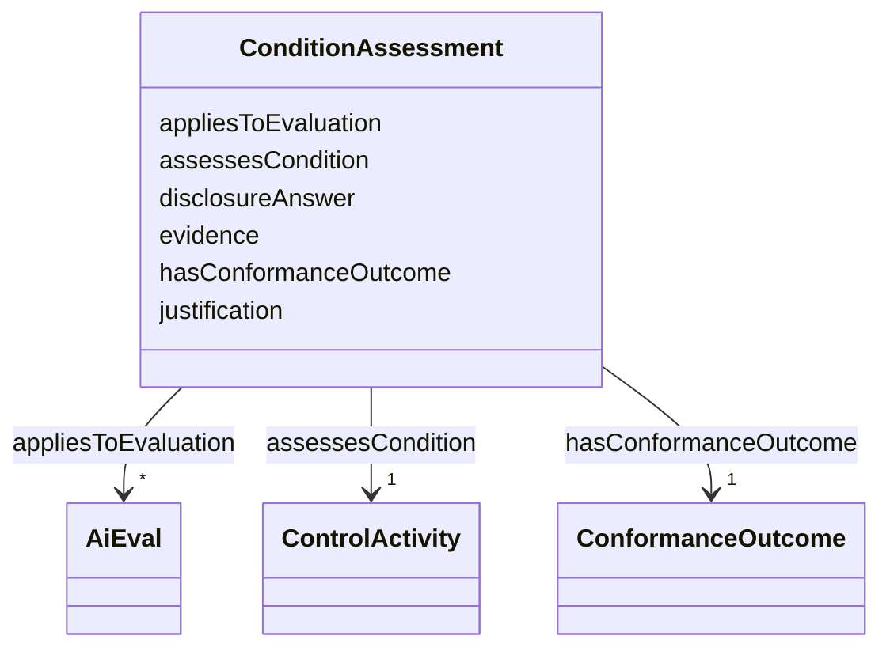

---
search:
  boost: 10.0
---

# Class: ConditionAssessment

_One answer of a completed checklist, for one condition of the evaluation standard._

<div data-search-exclude markdown="1">

URI: [nexus:ConditionAssessment](https://w3id.org/ai-atlas-nexus/ConditionAssessment)



<!-- no inheritance hierarchy -->

## Class Properties

| Property  | Value                                                                            |
| --------- | -------------------------------------------------------------------------------- |
| Class URI | [nexus:ConditionAssessment](https://w3id.org/ai-atlas-nexus/ConditionAssessment) |

## Slots

| Name                                              | Cardinality and Range                               | Description                                                                      | Inheritance |
| ------------------------------------------------- | --------------------------------------------------- | -------------------------------------------------------------------------------- | ----------- |
| [assessesCondition](assessesCondition.md)         | 1 <br/> [ControlActivity](ControlActivity.md)       | The condition of the evaluation standard that is assessed                        | direct      |
| [hasConformanceOutcome](hasConformanceOutcome.md) | 1 <br/> [ConformanceOutcome](ConformanceOutcome.md) | Whether the condition was fulfilled                                              | direct      |
| [evidence](evidence.md)                           | 0..1 <br/> [String](String.md)                      | Notes or evidence supporting the answer, e                                       | direct      |
| [justification](justification.md)                 | 0..1 <br/> [String](String.md)                      | Why a condition was not fulfilled, or how the same principle was achieved via... | direct      |
| [disclosureAnswer](disclosureAnswer.md)           | 0..1 <br/> [Boolean](Boolean.md)                    | For disclosure conditions (e                                                     | direct      |
| [appliesToEvaluation](appliesToEvaluation.md)     | \* <br/> [AiEval](AiEval.md)                        | The evaluations of the engagement that this answer is specific to                | direct      |

## Usages

| used by                                                           | used in                                             | type  | used                                          |
| ----------------------------------------------------------------- | --------------------------------------------------- | ----- | --------------------------------------------- |
| [EvaluationStandardConformance](EvaluationStandardConformance.md) | [hasConditionAssessment](hasConditionAssessment.md) | range | [ConditionAssessment](ConditionAssessment.md) |

## Rules

###

| Rule Applied    | Preconditions                                                                                                         | Postconditions                          | Elseconditions |
| --------------- | --------------------------------------------------------------------------------------------------------------------- | --------------------------------------- | -------------- |
| slot_conditions | `{'hasConformanceOutcome': {'any_of': [{'equals_string': 'NOT_FULFILLED'}, {'equals_string': 'ALTERNATIVE_MEANS'}]}}` | `{'justification': {'required': True}}` |                |

## Identifier and Mapping Information

### Schema Source

- from schema: https://w3id.org/ai-atlas-nexus/ai-risk-ontology

## Mappings

| Mapping Type | Mapped Value              |
| ------------ | ------------------------- |
| self         | nexus:ConditionAssessment |
| native       | nexus:ConditionAssessment |
| related      | earl:TestResult           |
| close        | earl:Assertion            |

## LinkML Source

<!-- TODO: investigate https://stackoverflow.com/questions/37606292/how-to-create-tabbed-code-blocks-in-mkdocs-or-sphinx -->

### Direct

<details>
```yaml
name: ConditionAssessment
description: One answer of a completed checklist, for one condition of the evaluation
  standard.
from_schema: https://w3id.org/ai-atlas-nexus/ai-risk-ontology
close_mappings:
- earl:Assertion
related_mappings:
- earl:TestResult
slots:
- assessesCondition
- hasConformanceOutcome
- evidence
- justification
- disclosureAnswer
- appliesToEvaluation
slot_usage:
  assessesCondition:
    name: assessesCondition
    required: true
  hasConformanceOutcome:
    name: hasConformanceOutcome
    required: true
  evidence:
    name: evidence
    description: Notes or evidence supporting the answer, e.g. a link to a published
      policy.
class_uri: nexus:ConditionAssessment
rules:
- preconditions:
    slot_conditions:
      hasConformanceOutcome:
        name: hasConformanceOutcome
        any_of:
        - equals_string: NOT_FULFILLED
        - equals_string: ALTERNATIVE_MEANS
  postconditions:
    slot_conditions:
      justification:
        name: justification
        required: true
  description: A justification is required when a condition is not fulfilled literally.

````
</details>

### Induced

<details>
```yaml
name: ConditionAssessment
description: One answer of a completed checklist, for one condition of the evaluation
  standard.
from_schema: https://w3id.org/ai-atlas-nexus/ai-risk-ontology
close_mappings:
- earl:Assertion
related_mappings:
- earl:TestResult
slot_usage:
  assessesCondition:
    name: assessesCondition
    required: true
  hasConformanceOutcome:
    name: hasConformanceOutcome
    required: true
  evidence:
    name: evidence
    description: Notes or evidence supporting the answer, e.g. a link to a published
      policy.
attributes:
  assessesCondition:
    name: assessesCondition
    description: The condition of the evaluation standard that is assessed.
    from_schema: https://w3id.org/ai-atlas-nexus/ai-risk-ontology
    rank: 1000
    slot_uri: earl:test
    owner: ConditionAssessment
    domain_of:
    - ConditionAssessment
    range: ControlActivity
    required: true
    inlined: false
  hasConformanceOutcome:
    name: hasConformanceOutcome
    description: Whether the condition was fulfilled.
    from_schema: https://w3id.org/ai-atlas-nexus/ai-risk-ontology
    close_mappings:
    - dpv:hasComplianceStatus
    rank: 1000
    slot_uri: earl:outcome
    owner: ConditionAssessment
    domain_of:
    - ConditionAssessment
    range: ConformanceOutcome
    required: true
  evidence:
    name: evidence
    description: Notes or evidence supporting the answer, e.g. a link to a published
      policy.
    from_schema: https://w3id.org/ai-atlas-nexus/ai-risk-ontology
    rank: 1000
    owner: ConditionAssessment
    domain_of:
    - Fact
    - ConditionAssessment
    range: string
  justification:
    name: justification
    description: Why a condition was not fulfilled, or how the same principle was
      achieved via alternative means.
    from_schema: https://w3id.org/ai-atlas-nexus/ai-risk-ontology
    related_mappings:
    - earl:info
    rank: 1000
    slot_uri: nexus:justification
    owner: ConditionAssessment
    domain_of:
    - ConditionAssessment
    range: string
  disclosureAnswer:
    name: disclosureAnswer
    description: For disclosure conditions (e.g. AEF-1 2.4.x), whether the disclosed
      circumstance applies, e.g. true if the evaluator was paid by the system provider.
      Independent of whether the condition was fulfilled.
    from_schema: https://w3id.org/ai-atlas-nexus/ai-risk-ontology
    rank: 1000
    slot_uri: nexus:disclosureAnswer
    owner: ConditionAssessment
    domain_of:
    - ConditionAssessment
    range: boolean
  appliesToEvaluation:
    name: appliesToEvaluation
    description: The evaluations of the engagement that this answer is specific to.
      When absent, the answer applies to the engagement as a whole.
    from_schema: https://w3id.org/ai-atlas-nexus/ai-risk-ontology
    rank: 1000
    slot_uri: nexus:appliesToEvaluation
    owner: ConditionAssessment
    domain_of:
    - ConditionAssessment
    range: AiEval
    multivalued: true
    inlined: false
class_uri: nexus:ConditionAssessment
rules:
- preconditions:
    slot_conditions:
      hasConformanceOutcome:
        name: hasConformanceOutcome
        any_of:
        - equals_string: NOT_FULFILLED
        - equals_string: ALTERNATIVE_MEANS
  postconditions:
    slot_conditions:
      justification:
        name: justification
        required: true
  description: A justification is required when a condition is not fulfilled literally.

````

</details></div>
