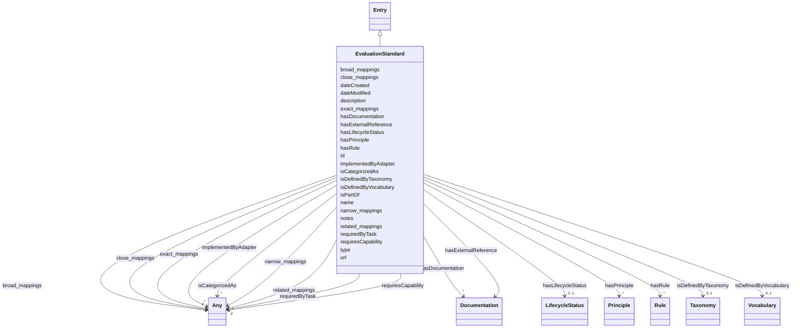

---
search:
  boost: 10.0
---

# Class: EvaluationStandard

_A standard defining minimum conditions, processes, or independence criteria required for conducting AI evaluations_

<div data-search-exclude markdown="1">

URI: [dpv:ManagementStandard](https://w3id.org/dpv#ManagementStandard)



## Inheritance

- [Entity](Entity.md)
  - [Entry](Entry.md)
    - **EvaluationStandard**

## Class Properties

| Property  | Value                                                             |
| --------- | ----------------------------------------------------------------- |
| Class URI | [dpv:ManagementStandard](https://w3id.org/dpv#ManagementStandard) |

## Slots

| Name                                              | Cardinality and Range                            | Description                                                                      | Inheritance         |
| ------------------------------------------------- | ------------------------------------------------ | -------------------------------------------------------------------------------- | ------------------- |
| [hasPrinciple](hasPrinciple.md)                   | \* <br/> [Principle](Principle.md)               | The principle(s) this entry is composed of or belongs to                         | direct              |
| [type](type.md)                                   | 0..1 <br/> [String](String.md)                   | The type or class designation of this entity instance                            | direct              |
| [isDefinedByTaxonomy](isDefinedByTaxonomy.md)     | 0..1 <br/> [Taxonomy](Taxonomy.md)               | A relationship where a concept or a concept group is defined by a taxonomy       | [Entry](Entry.md)   |
| [isDefinedByVocabulary](isDefinedByVocabulary.md) | 0..1 <br/> [Vocabulary](Vocabulary.md)           | A relationship where a term or a term group is defined by a vocabulary           | [Entry](Entry.md)   |
| [hasDocumentation](hasDocumentation.md)           | \* <br/> [Documentation](Documentation.md)       | Indicates documentation associated with an entity                                | [Entry](Entry.md)   |
| [hasExternalReference](hasExternalReference.md)   | \* <br/> [Documentation](Documentation.md)       | External references / additional resources related to this entity, such as ar... | [Entry](Entry.md)   |
| [isPartOf](isPartOf.md)                           | 0..1 <br/> [String](String.md)                   | A relationship where an entity is part of another entity                         | [Entry](Entry.md)   |
| [requiredByTask](requiredByTask.md)               | \* <br/> [Any](Any.md)                           | Indicates that this entry is required to perform a specific AI task              | [Entry](Entry.md)   |
| [requiresCapability](requiresCapability.md)       | \* <br/> [Any](Any.md)                           | Indicates that this entry requires a specific capability                         | [Entry](Entry.md)   |
| [implementedByAdapter](implementedByAdapter.md)   | \* <br/> [Any](Any.md)                           | Indicates that this capability is implemented by a specific adapter              | [Entry](Entry.md)   |
| [hasRule](hasRule.md)                             | \* <br/> [Rule](Rule.md)                         | Specifying applicability or inclusion of a rule within specified context         | [Entry](Entry.md)   |
| [id](id.md)                                       | 1 <br/> [String](String.md)                      | A unique identifier to this instance of the model element                        | [Entity](Entity.md) |
| [name](name.md)                                   | 0..1 <br/> [String](String.md)                   | A text name of this instance                                                     | [Entity](Entity.md) |
| [description](description.md)                     | 0..1 <br/> [String](String.md)                   | The description of an entity                                                     | [Entity](Entity.md) |
| [url](url.md)                                     | 0..1 <br/> [Uri](Uri.md)                         | An optional URL associated with this instance                                    | [Entity](Entity.md) |
| [dateCreated](dateCreated.md)                     | 0..1 <br/> [Date](Date.md)                       | The date on which the entity was created                                         | [Entity](Entity.md) |
| [dateModified](dateModified.md)                   | 0..1 <br/> [Date](Date.md)                       | The date on which the entity was most recently modified                          | [Entity](Entity.md) |
| [exact_mappings](exact_mappings.md)               | \* <br/> [Any](Any.md)                           | The property is used to link two concepts, indicating a high degree of confid... | [Entity](Entity.md) |
| [close_mappings](close_mappings.md)               | \* <br/> [Any](Any.md)                           | The property is used to link two concepts that are sufficiently similar that ... | [Entity](Entity.md) |
| [related_mappings](related_mappings.md)           | \* <br/> [Any](Any.md)                           | The property skos:relatedMatch is used to state an associative mapping link b... | [Entity](Entity.md) |
| [narrow_mappings](narrow_mappings.md)             | \* <br/> [Any](Any.md)                           | The property is used to state a hierarchical mapping link between two concept... | [Entity](Entity.md) |
| [broad_mappings](broad_mappings.md)               | \* <br/> [Any](Any.md)                           | The property is used to state a hierarchical mapping link between two concept... | [Entity](Entity.md) |
| [isCategorizedAs](isCategorizedAs.md)             | \* <br/> [Any](Any.md)                           | A relationship where an entity has been deemed to be categorized                 | [Entity](Entity.md) |
| [hasLifecycleStatus](hasLifecycleStatus.md)       | 0..1 <br/> [LifecycleStatus](LifecycleStatus.md) | The editorial / publication lifecycle state of this entity                       | [Entity](Entity.md) |
| [notes](notes.md)                                 | \* <br/> [String](String.md)                     | Free-text editorial notes, source breadcrumbs, or build-time provenance that ... | [Entity](Entity.md) |

## Usages

| used by                                                           | used in                                     | type  | used                                        |
| ----------------------------------------------------------------- | ------------------------------------------- | ----- | ------------------------------------------- |
| [EvaluationStandardConformance](EvaluationStandardConformance.md) | [conformsToStandard](conformsToStandard.md) | range | [EvaluationStandard](EvaluationStandard.md) |

## Identifier and Mapping Information

### Schema Source

- from schema: https://w3id.org/ai-atlas-nexus/ai-risk-ontology

## Mappings

| Mapping Type | Mapped Value             |
| ------------ | ------------------------ |
| self         | dpv:ManagementStandard   |
| native       | nexus:EvaluationStandard |

## LinkML Source

<!-- TODO: investigate https://stackoverflow.com/questions/37606292/how-to-create-tabbed-code-blocks-in-mkdocs-or-sphinx -->

### Direct

<details>
```yaml
name: EvaluationStandard
description: A standard defining minimum conditions, processes, or independence criteria
  required for conducting AI evaluations
from_schema: https://w3id.org/ai-atlas-nexus/ai-risk-ontology
is_a: Entry
slots:
- hasPrinciple
attributes:
  type:
    name: type
    description: The type or class designation of this entity instance.
    from_schema: https://w3id.org/ai-atlas-nexus/common
    designates_type: true
    domain_of:
    - Organization
    - Vocabulary
    - Taxonomy
    - Concept
    - Control
    - Group
    - Entry
    - Policy
    - Rule
    - Permission
    - Prohibition
    - Obligation
    - Recommendation
    - Certification
    - EvaluationStandard
    - BenchmarkMetadataCard
    - ControlActivity
    - ControlActivityPermission
    - ControlActivityProhibition
    - ControlActivityObligation
    - ControlActivityRecommendation
    - Requirement
    range: string
class_uri: dpv:ManagementStandard

````
</details>

### Induced

<details>
```yaml
name: EvaluationStandard
description: A standard defining minimum conditions, processes, or independence criteria
  required for conducting AI evaluations
from_schema: https://w3id.org/ai-atlas-nexus/ai-risk-ontology
is_a: Entry
attributes:
  type:
    name: type
    description: The type or class designation of this entity instance.
    from_schema: https://w3id.org/ai-atlas-nexus/common
    designates_type: true
    owner: EvaluationStandard
    domain_of:
    - Organization
    - Vocabulary
    - Taxonomy
    - Concept
    - Control
    - Group
    - Entry
    - Policy
    - Rule
    - Permission
    - Prohibition
    - Obligation
    - Recommendation
    - Certification
    - EvaluationStandard
    - BenchmarkMetadataCard
    - ControlActivity
    - ControlActivityPermission
    - ControlActivityProhibition
    - ControlActivityObligation
    - ControlActivityRecommendation
    - Requirement
    range: string
  hasPrinciple:
    name: hasPrinciple
    description: The principle(s) this entry is composed of or belongs to
    from_schema: https://w3id.org/ai-atlas-nexus/ai-risk-ontology
    rank: 1000
    domain: Entry
    slot_uri: dpv:isPartOf
    owner: EvaluationStandard
    domain_of:
    - EvaluationStandard
    - Requirement
    range: Principle
    multivalued: true
    inlined: false
  isDefinedByTaxonomy:
    name: isDefinedByTaxonomy
    description: A relationship where a concept or a concept group is defined by a
      taxonomy
    from_schema: https://w3id.org/ai-atlas-nexus/ai-risk-ontology
    rank: 1000
    slot_uri: schema:isPartOf
    owner: EvaluationStandard
    domain_of:
    - Concept
    - Control
    - Group
    - Entry
    - Policy
    - Rule
    - RiskControlGroup
    - RiskGroup
    - Risk
    - RiskControl
    - Action
    - RiskIncident
    - CapabilityGroup
    - AiTaskDomain
    - AiTaskGroup
    - Stakeholder
    - StakeholderGroup
    - Requirement
    range: Taxonomy
  isDefinedByVocabulary:
    name: isDefinedByVocabulary
    description: A relationship where a term or a term group is defined by a vocabulary
    from_schema: https://w3id.org/ai-atlas-nexus/ai-risk-ontology
    rank: 1000
    slot_uri: schema:isPartOf
    owner: EvaluationStandard
    domain_of:
    - Entry
    - Term
    - Adapter
    - LLMIntrinsic
    range: Vocabulary
  hasDocumentation:
    name: hasDocumentation
    description: Indicates documentation associated with an entity.
    from_schema: https://w3id.org/ai-atlas-nexus/ai-risk-ontology
    rank: 1000
    slot_uri: airo:hasDocumentation
    owner: EvaluationStandard
    domain_of:
    - Dataset
    - Vocabulary
    - Taxonomy
    - Concept
    - Group
    - Entry
    - Term
    - Principle
    - Rule
    - RiskTaxonomy
    - RiskControlGroupTaxonomy
    - Action
    - BaseAi
    - LargeLanguageModelFamily
    - AiTaskTaxonomy
    - AiEval
    - EveryEvalAIResult
    - BenchmarkMetadataCard
    - ThirdPartyEvaluationEngagement
    - Adapter
    - LLMIntrinsic
    range: Documentation
    multivalued: true
    inlined: false
  hasExternalReference:
    name: hasExternalReference
    description: External references / additional resources related to this entity,
      such as articles, tools, or datasets. Distinct from hasDocumentation, which
      documents the entity itself. External references are not necessarily curated
      or vetted, and quality will vary.
    from_schema: https://w3id.org/ai-atlas-nexus/ai-risk-ontology
    aliases:
    - additional resources
    - external_links
    close_mappings:
    - rdfs:seeAlso
    rank: 1000
    slot_uri: nexus:hasExternalReference
    owner: EvaluationStandard
    domain_of:
    - Control
    - Entry
    range: Documentation
    multivalued: true
    inlined: false
  isPartOf:
    name: isPartOf
    description: A relationship where an entity is part of another entity
    from_schema: https://w3id.org/ai-atlas-nexus/ai-risk-ontology
    rank: 1000
    slot_uri: schema:isPartOf
    owner: EvaluationStandard
    domain_of:
    - Entry
    - Risk
    - CapabilityGroup
    - LargeLanguageModel
    - AiTaskGroup
    - Stakeholder
    range: string
  requiredByTask:
    name: requiredByTask
    description: Indicates that this entry is required to perform a specific AI task.
    from_schema: https://w3id.org/ai-atlas-nexus/ai-risk-ontology
    rank: 1000
    domain: Entry
    owner: EvaluationStandard
    domain_of:
    - Entry
    - Capability
    inverse: requiresCapability
    range: Any
    multivalued: true
    inlined: false
  requiresCapability:
    name: requiresCapability
    description: Indicates that this entry requires a specific capability
    from_schema: https://w3id.org/ai-atlas-nexus/ai-risk-ontology
    rank: 1000
    domain: Any
    owner: EvaluationStandard
    domain_of:
    - Entry
    - LargeLanguageModel
    - AiTask
    - Adapter
    inverse: requiredByTask
    range: Any
    multivalued: true
    inlined: false
  implementedByAdapter:
    name: implementedByAdapter
    description: Indicates that this capability is implemented by a specific adapter.
      This relationship distinguishes the abstract capability (what can be done) from
      the technical implementation mechanism (how it is added/extended via adapters).
    from_schema: https://w3id.org/ai-atlas-nexus/ai-risk-ontology
    rank: 1000
    domain: Any
    owner: EvaluationStandard
    domain_of:
    - Entry
    - Capability
    inverse: implementsCapability
    range: Any
    multivalued: true
    inlined: false
  hasRule:
    name: hasRule
    description: Specifying applicability or inclusion of a rule within specified
      context.
    from_schema: https://w3id.org/ai-atlas-nexus/ai-risk-ontology
    rank: 1000
    slot_uri: dpv:hasRule
    owner: EvaluationStandard
    domain_of:
    - Entry
    - LLMQuestionPolicy
    - Rule
    - Requirement
    range: Rule
    multivalued: true
    inlined: false
  id:
    name: id
    description: A unique identifier to this instance of the model element. Example
      identifiers include UUID, URI, URN, etc.
    from_schema: https://w3id.org/ai-atlas-nexus/ai-risk-ontology
    rank: 1000
    slot_uri: schema:identifier
    identifier: true
    owner: EvaluationStandard
    domain_of:
    - Entity
    range: string
    required: true
  name:
    name: name
    description: A text name of this instance.
    from_schema: https://w3id.org/ai-atlas-nexus/ai-risk-ontology
    rank: 1000
    slot_uri: schema:name
    owner: EvaluationStandard
    domain_of:
    - Entity
    - BenchmarkMetadataCard
    range: string
  description:
    name: description
    description: The description of an entity
    from_schema: https://w3id.org/ai-atlas-nexus/ai-risk-ontology
    rank: 1000
    slot_uri: schema:description
    owner: EvaluationStandard
    domain_of:
    - Entity
    range: string
  url:
    name: url
    description: An optional URL associated with this instance.
    from_schema: https://w3id.org/ai-atlas-nexus/ai-risk-ontology
    rank: 1000
    slot_uri: schema:url
    owner: EvaluationStandard
    domain_of:
    - Entity
    range: uri
  dateCreated:
    name: dateCreated
    description: The date on which the entity was created.
    from_schema: https://w3id.org/ai-atlas-nexus/ai-risk-ontology
    rank: 1000
    slot_uri: schema:dateCreated
    owner: EvaluationStandard
    domain_of:
    - Entity
    range: date
    required: false
  dateModified:
    name: dateModified
    description: The date on which the entity was most recently modified.
    from_schema: https://w3id.org/ai-atlas-nexus/ai-risk-ontology
    rank: 1000
    slot_uri: schema:dateModified
    owner: EvaluationStandard
    domain_of:
    - Entity
    range: date
    required: false
  exact_mappings:
    name: exact_mappings
    description: The property is used to link two concepts, indicating a high degree
      of confidence that the concepts can be used interchangeably across a wide range
      of information retrieval applications
    from_schema: https://w3id.org/ai-atlas-nexus/ai-risk-ontology
    rank: 1000
    slot_uri: skos:exactMatch
    owner: EvaluationStandard
    domain_of:
    - Entity
    range: Any
    multivalued: true
    inlined: false
  close_mappings:
    name: close_mappings
    description: The property is used to link two concepts that are sufficiently similar
      that they can be used interchangeably in some information retrieval applications.
    from_schema: https://w3id.org/ai-atlas-nexus/ai-risk-ontology
    rank: 1000
    slot_uri: skos:closeMatch
    owner: EvaluationStandard
    domain_of:
    - Entity
    range: Any
    multivalued: true
    inlined: false
  related_mappings:
    name: related_mappings
    description: The property skos:relatedMatch is used to state an associative mapping
      link between two concepts.
    from_schema: https://w3id.org/ai-atlas-nexus/ai-risk-ontology
    rank: 1000
    slot_uri: skos:relatedMatch
    owner: EvaluationStandard
    domain_of:
    - Entity
    range: Any
    multivalued: true
    inlined: false
  narrow_mappings:
    name: narrow_mappings
    description: The property is used to state a hierarchical mapping link between
      two concepts, indicating that the concept linked to, is a narrower concept than
      the originating concept.
    from_schema: https://w3id.org/ai-atlas-nexus/ai-risk-ontology
    rank: 1000
    slot_uri: skos:narrowMatch
    owner: EvaluationStandard
    domain_of:
    - Entity
    range: Any
    multivalued: true
    inlined: false
  broad_mappings:
    name: broad_mappings
    description: The property is used to state a hierarchical mapping link between
      two concepts, indicating that the concept linked to, is a broader concept than
      the originating concept.
    from_schema: https://w3id.org/ai-atlas-nexus/ai-risk-ontology
    rank: 1000
    slot_uri: skos:broadMatch
    owner: EvaluationStandard
    domain_of:
    - Entity
    range: Any
    multivalued: true
    inlined: false
  isCategorizedAs:
    name: isCategorizedAs
    description: A relationship where an entity has been deemed to be categorized
    from_schema: https://w3id.org/ai-atlas-nexus/ai-risk-ontology
    rank: 1000
    slot_uri: nexus:isCategorizedAs
    owner: EvaluationStandard
    domain_of:
    - Entity
    range: Any
    multivalued: true
    inlined: false
  hasLifecycleStatus:
    name: hasLifecycleStatus
    description: The editorial / publication lifecycle state of this entity. Distinct
      from AiLifecyclePhase, which describes an AI system's runtime evolution rather
      than the editorial workflow of a catalogued entry.
    from_schema: https://w3id.org/ai-atlas-nexus/ai-risk-ontology
    aliases:
    - lifecycle_status
    - doc_status
    rank: 1000
    slot_uri: adms:status
    owner: EvaluationStandard
    domain_of:
    - Entity
    range: LifecycleStatus
  notes:
    name: notes
    description: Free-text editorial notes, source breadcrumbs, or build-time provenance
      that do not belong in the user-facing description. Opaque to consumers.
    from_schema: https://w3id.org/ai-atlas-nexus/ai-risk-ontology
    rank: 1000
    slot_uri: skos:note
    owner: EvaluationStandard
    domain_of:
    - Entity
    range: string
    recommended: false
    multivalued: true
class_uri: dpv:ManagementStandard

````

</details></div>
