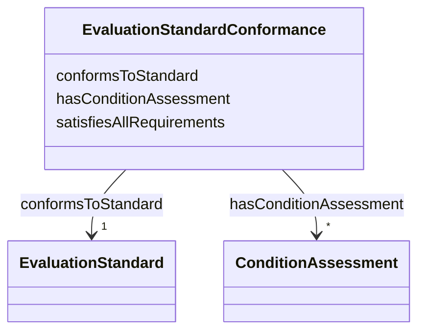

---
search:
  boost: 10.0
---

# Class: EvaluationStandardConformance

_A completed checklist reporting how an engagement addressed the conditions of an evaluation standard._

<div data-search-exclude markdown="1">

URI: [nexus:EvaluationStandardConformance](https://w3id.org/ai-atlas-nexus/EvaluationStandardConformance)



<!-- no inheritance hierarchy -->

## Class Properties

| Property  | Value                                                                                                |
| --------- | ---------------------------------------------------------------------------------------------------- |
| Class URI | [nexus:EvaluationStandardConformance](https://w3id.org/ai-atlas-nexus/EvaluationStandardConformance) |

## Slots

| Name                                                    | Cardinality and Range                                  | Description                                                                      | Inheritance |
| ------------------------------------------------------- | ------------------------------------------------------ | -------------------------------------------------------------------------------- | ----------- |
| [conformsToStandard](conformsToStandard.md)             | 1 <br/> [EvaluationStandard](EvaluationStandard.md)    | The evaluation standard the checklist is completed against                       | direct      |
| [satisfiesAllRequirements](satisfiesAllRequirements.md) | 0..1 <br/> [Boolean](Boolean.md)                       | The overall answer to whether the engagement satisfies all the minimum requir... | direct      |
| [hasConditionAssessment](hasConditionAssessment.md)     | \* <br/> [ConditionAssessment](ConditionAssessment.md) | The per-condition answers of a completed checklist                               | direct      |

## Usages

| used by                                                             | used in                                             | type  | used                                                              |
| ------------------------------------------------------------------- | --------------------------------------------------- | ----- | ----------------------------------------------------------------- |
| [ThirdPartyEvaluationEngagement](ThirdPartyEvaluationEngagement.md) | [hasStandardConformance](hasStandardConformance.md) | range | [EvaluationStandardConformance](EvaluationStandardConformance.md) |

## Identifier and Mapping Information

### Schema Source

- from schema: https://w3id.org/ai-atlas-nexus/ai-risk-ontology

## Mappings

| Mapping Type | Mapped Value                        |
| ------------ | ----------------------------------- |
| self         | nexus:EvaluationStandardConformance |
| native       | nexus:EvaluationStandardConformance |
| related      | dpv:ComplianceStatus                |

## LinkML Source

<!-- TODO: investigate https://stackoverflow.com/questions/37606292/how-to-create-tabbed-code-blocks-in-mkdocs-or-sphinx -->

### Direct

<details>
```yaml
name: EvaluationStandardConformance
description: A completed checklist reporting how an engagement addressed the conditions
  of an evaluation standard.
from_schema: https://w3id.org/ai-atlas-nexus/ai-risk-ontology
related_mappings:
- dpv:ComplianceStatus
slots:
- conformsToStandard
- satisfiesAllRequirements
- hasConditionAssessment
slot_usage:
  conformsToStandard:
    name: conformsToStandard
    required: true
class_uri: nexus:EvaluationStandardConformance

````
</details>

### Induced

<details>
```yaml
name: EvaluationStandardConformance
description: A completed checklist reporting how an engagement addressed the conditions
  of an evaluation standard.
from_schema: https://w3id.org/ai-atlas-nexus/ai-risk-ontology
related_mappings:
- dpv:ComplianceStatus
slot_usage:
  conformsToStandard:
    name: conformsToStandard
    required: true
attributes:
  conformsToStandard:
    name: conformsToStandard
    description: The evaluation standard the checklist is completed against.
    from_schema: https://w3id.org/ai-atlas-nexus/ai-risk-ontology
    rank: 1000
    slot_uri: dcterms:conformsTo
    owner: EvaluationStandardConformance
    domain_of:
    - EvaluationStandardConformance
    range: EvaluationStandard
    required: true
    inlined: false
  satisfiesAllRequirements:
    name: satisfiesAllRequirements
    description: The overall answer to whether the engagement satisfies all the minimum
      requirements of the standard.
    from_schema: https://w3id.org/ai-atlas-nexus/ai-risk-ontology
    rank: 1000
    slot_uri: nexus:satisfiesAllRequirements
    owner: EvaluationStandardConformance
    domain_of:
    - EvaluationStandardConformance
    range: boolean
  hasConditionAssessment:
    name: hasConditionAssessment
    description: The per-condition answers of a completed checklist.
    from_schema: https://w3id.org/ai-atlas-nexus/ai-risk-ontology
    rank: 1000
    slot_uri: nexus:hasConditionAssessment
    owner: EvaluationStandardConformance
    domain_of:
    - EvaluationStandardConformance
    range: ConditionAssessment
    multivalued: true
    inlined: true
    inlined_as_list: true
class_uri: nexus:EvaluationStandardConformance

````

</details></div>
