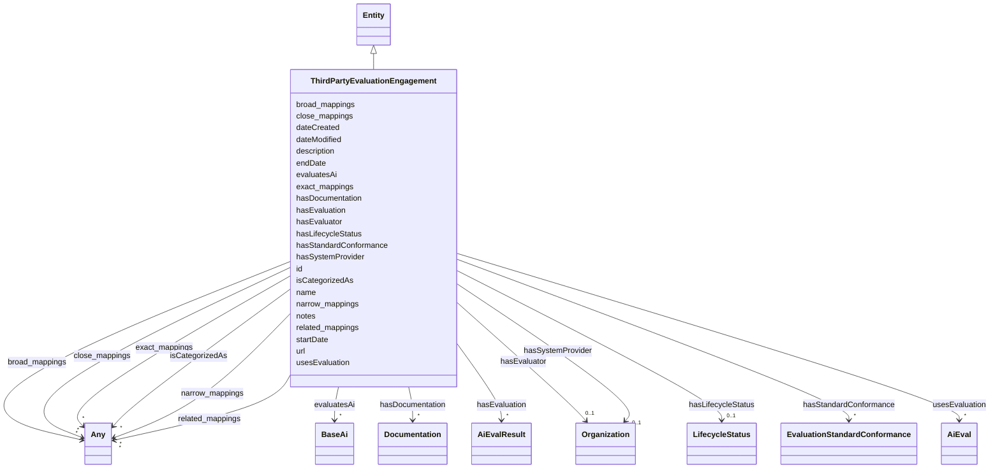

---
search:
  boost: 10.0
---

# Class: ThirdPartyEvaluationEngagement

_A single engagement in which an independent third-party evaluator evaluates one or more AI systems of a system provider, using one or more benchmarks or other evaluations, and reports the operating conditions of the engagement against evaluation standards such as AEF-1._

<div data-search-exclude markdown="1">

URI: [nexus:ThirdPartyEvaluationEngagement](https://w3id.org/ai-atlas-nexus/ThirdPartyEvaluationEngagement)



## Inheritance

- [Entity](Entity.md)
  - **ThirdPartyEvaluationEngagement**

## Class Properties

| Property  | Value                                                                                                  |
| --------- | ------------------------------------------------------------------------------------------------------ |
| Class URI | [nexus:ThirdPartyEvaluationEngagement](https://w3id.org/ai-atlas-nexus/ThirdPartyEvaluationEngagement) |

## Slots

| Name                                                | Cardinality and Range                                                      | Description                                                                      | Inheritance         |
| --------------------------------------------------- | -------------------------------------------------------------------------- | -------------------------------------------------------------------------------- | ------------------- |
| [hasEvaluator](hasEvaluator.md)                     | 0..1 <br/> [Organization](Organization.md)                                 | The organization that conducted the evaluation                                   | direct              |
| [hasSystemProvider](hasSystemProvider.md)           | 0..1 <br/> [Organization](Organization.md)                                 | The organization which develops or operates the AI systems being evaluated       | direct              |
| [evaluatesAi](evaluatesAi.md)                       | \* <br/> [BaseAi](BaseAi.md)                                               | The AI systems or models (including specific versions) evaluated in the engag... | direct              |
| [usesEvaluation](usesEvaluation.md)                 | \* <br/> [AiEval](AiEval.md)                                               | The benchmarks, metrics, or other AI evaluations run as part of the engagemen... | direct              |
| [hasEvaluation](hasEvaluation.md)                   | \* <br/> [AiEvalResult](AiEvalResult.md)                                   | The results produced by the engagement, across all of its evaluations            | direct              |
| [hasStandardConformance](hasStandardConformance.md) | \* <br/> [EvaluationStandardConformance](EvaluationStandardConformance.md) | The completed checklist(s) of evaluation standards (e                            | direct              |
| [startDate](startDate.md)                           | 0..1 <br/> [Date](Date.md)                                                 | The date on which the entity started                                             | direct              |
| [endDate](endDate.md)                               | 0..1 <br/> [Date](Date.md)                                                 | The date on which the entity ended                                               | direct              |
| [hasDocumentation](hasDocumentation.md)             | \* <br/> [Documentation](Documentation.md)                                 | Indicates documentation associated with an entity                                | direct              |
| [id](id.md)                                         | 1 <br/> [String](String.md)                                                | A unique identifier to this instance of the model element                        | [Entity](Entity.md) |
| [name](name.md)                                     | 0..1 <br/> [String](String.md)                                             | A text name of this instance                                                     | [Entity](Entity.md) |
| [description](description.md)                       | 0..1 <br/> [String](String.md)                                             | The description of an entity                                                     | [Entity](Entity.md) |
| [url](url.md)                                       | 0..1 <br/> [Uri](Uri.md)                                                   | An optional URL associated with this instance                                    | [Entity](Entity.md) |
| [dateCreated](dateCreated.md)                       | 0..1 <br/> [Date](Date.md)                                                 | The date on which the entity was created                                         | [Entity](Entity.md) |
| [dateModified](dateModified.md)                     | 0..1 <br/> [Date](Date.md)                                                 | The date on which the entity was most recently modified                          | [Entity](Entity.md) |
| [exact_mappings](exact_mappings.md)                 | \* <br/> [Any](Any.md)                                                     | The property is used to link two concepts, indicating a high degree of confid... | [Entity](Entity.md) |
| [close_mappings](close_mappings.md)                 | \* <br/> [Any](Any.md)                                                     | The property is used to link two concepts that are sufficiently similar that ... | [Entity](Entity.md) |
| [related_mappings](related_mappings.md)             | \* <br/> [Any](Any.md)                                                     | The property skos:relatedMatch is used to state an associative mapping link b... | [Entity](Entity.md) |
| [narrow_mappings](narrow_mappings.md)               | \* <br/> [Any](Any.md)                                                     | The property is used to state a hierarchical mapping link between two concept... | [Entity](Entity.md) |
| [broad_mappings](broad_mappings.md)                 | \* <br/> [Any](Any.md)                                                     | The property is used to state a hierarchical mapping link between two concept... | [Entity](Entity.md) |
| [isCategorizedAs](isCategorizedAs.md)               | \* <br/> [Any](Any.md)                                                     | A relationship where an entity has been deemed to be categorized                 | [Entity](Entity.md) |
| [hasLifecycleStatus](hasLifecycleStatus.md)         | 0..1 <br/> [LifecycleStatus](LifecycleStatus.md)                           | The editorial / publication lifecycle state of this entity                       | [Entity](Entity.md) |
| [notes](notes.md)                                   | \* <br/> [String](String.md)                                               | Free-text editorial notes, source breadcrumbs, or build-time provenance that ... | [Entity](Entity.md) |

## Usages

| used by                   | used in                                                               | type  | used                                                                |
| ------------------------- | --------------------------------------------------------------------- | ----- | ------------------------------------------------------------------- |
| [Container](Container.md) | [thirdpartyevaluationengagements](thirdpartyevaluationengagements.md) | range | [ThirdPartyEvaluationEngagement](ThirdPartyEvaluationEngagement.md) |

## Identifier and Mapping Information

### Schema Source

- from schema: https://w3id.org/ai-atlas-nexus/ai-risk-ontology

## Mappings

| Mapping Type | Mapped Value                         |
| ------------ | ------------------------------------ |
| self         | nexus:ThirdPartyEvaluationEngagement |
| native       | nexus:ThirdPartyEvaluationEngagement |
| related      | dpv:Assessment                       |
| close        | prov:Activity                        |

## LinkML Source

<!-- TODO: investigate https://stackoverflow.com/questions/37606292/how-to-create-tabbed-code-blocks-in-mkdocs-or-sphinx -->

### Direct

<details>
```yaml
name: ThirdPartyEvaluationEngagement
description: A single engagement in which an independent third-party evaluator evaluates
  one or more AI systems of a system provider, using one or more benchmarks or other
  evaluations, and reports the operating conditions of the engagement against evaluation
  standards such as AEF-1.
from_schema: https://w3id.org/ai-atlas-nexus/ai-risk-ontology
close_mappings:
- prov:Activity
related_mappings:
- dpv:Assessment
is_a: Entity
slots:
- hasEvaluator
- hasSystemProvider
- evaluatesAi
- usesEvaluation
- hasEvaluation
- hasStandardConformance
- startDate
- endDate
- hasDocumentation
slot_usage:
  hasEvaluation:
    name: hasEvaluation
    description: The results produced by the engagement, across all of its evaluations.
class_uri: nexus:ThirdPartyEvaluationEngagement

````
</details>

### Induced

<details>
```yaml
name: ThirdPartyEvaluationEngagement
description: A single engagement in which an independent third-party evaluator evaluates
  one or more AI systems of a system provider, using one or more benchmarks or other
  evaluations, and reports the operating conditions of the engagement against evaluation
  standards such as AEF-1.
from_schema: https://w3id.org/ai-atlas-nexus/ai-risk-ontology
close_mappings:
- prov:Activity
related_mappings:
- dpv:Assessment
is_a: Entity
slot_usage:
  hasEvaluation:
    name: hasEvaluation
    description: The results produced by the engagement, across all of its evaluations.
attributes:
  hasEvaluator:
    name: hasEvaluator
    description: The organization that conducted the evaluation.
    from_schema: https://w3id.org/ai-atlas-nexus/ai-risk-ontology
    close_mappings:
    - prov:wasAssociatedWith
    related_mappings:
    - earl:assertedBy
    rank: 1000
    slot_uri: nexus:hasEvaluator
    owner: ThirdPartyEvaluationEngagement
    domain_of:
    - ThirdPartyEvaluationEngagement
    range: Organization
    inlined: false
  hasSystemProvider:
    name: hasSystemProvider
    description: The organization which develops or operates the AI systems being
      evaluated.
    from_schema: https://w3id.org/ai-atlas-nexus/ai-risk-ontology
    rank: 1000
    slot_uri: nexus:hasSystemProvider
    owner: ThirdPartyEvaluationEngagement
    domain_of:
    - ThirdPartyEvaluationEngagement
    range: Organization
    inlined: false
  evaluatesAi:
    name: evaluatesAi
    description: The AI systems or models (including specific versions) evaluated
      in the engagement.
    from_schema: https://w3id.org/ai-atlas-nexus/ai-risk-ontology
    related_mappings:
    - earl:subject
    rank: 1000
    slot_uri: nexus:evaluatesAi
    owner: ThirdPartyEvaluationEngagement
    domain_of:
    - ThirdPartyEvaluationEngagement
    range: BaseAi
    multivalued: true
    inlined: false
  usesEvaluation:
    name: usesEvaluation
    description: The benchmarks, metrics, or other AI evaluations run as part of the
      engagement.
    from_schema: https://w3id.org/ai-atlas-nexus/ai-risk-ontology
    close_mappings:
    - prov:used
    rank: 1000
    slot_uri: nexus:usesEvaluation
    owner: ThirdPartyEvaluationEngagement
    domain_of:
    - ThirdPartyEvaluationEngagement
    range: AiEval
    multivalued: true
    inlined: false
  hasEvaluation:
    name: hasEvaluation
    description: The results produced by the engagement, across all of its evaluations.
    from_schema: https://w3id.org/ai-atlas-nexus/ai-risk-ontology
    rank: 1000
    slot_uri: dqv:hasQualityMeasurement
    owner: ThirdPartyEvaluationEngagement
    domain_of:
    - AiModel
    - ThirdPartyEvaluationEngagement
    range: AiEvalResult
    multivalued: true
  hasStandardConformance:
    name: hasStandardConformance
    description: The completed checklist(s) of evaluation standards (e.g. AEF-1) that
      the engagement reports against.
    from_schema: https://w3id.org/ai-atlas-nexus/ai-risk-ontology
    rank: 1000
    slot_uri: nexus:hasStandardConformance
    owner: ThirdPartyEvaluationEngagement
    domain_of:
    - ThirdPartyEvaluationEngagement
    range: EvaluationStandardConformance
    multivalued: true
    inlined: true
    inlined_as_list: true
  startDate:
    name: startDate
    description: The date on which the entity started.
    from_schema: https://w3id.org/ai-atlas-nexus/ai-risk-ontology
    close_mappings:
    - prov:startedAtTime
    rank: 1000
    slot_uri: schema:startDate
    owner: ThirdPartyEvaluationEngagement
    domain_of:
    - ThirdPartyEvaluationEngagement
    range: date
  endDate:
    name: endDate
    description: The date on which the entity ended.
    from_schema: https://w3id.org/ai-atlas-nexus/ai-risk-ontology
    close_mappings:
    - prov:endedAtTime
    rank: 1000
    slot_uri: schema:endDate
    owner: ThirdPartyEvaluationEngagement
    domain_of:
    - ThirdPartyEvaluationEngagement
    range: date
  hasDocumentation:
    name: hasDocumentation
    description: Indicates documentation associated with an entity.
    from_schema: https://w3id.org/ai-atlas-nexus/ai-risk-ontology
    rank: 1000
    slot_uri: airo:hasDocumentation
    owner: ThirdPartyEvaluationEngagement
    domain_of:
    - Dataset
    - Vocabulary
    - Taxonomy
    - Concept
    - Group
    - Entry
    - Term
    - Principle
    - Rule
    - RiskTaxonomy
    - RiskControlGroupTaxonomy
    - Action
    - BaseAi
    - LargeLanguageModelFamily
    - AiTaskTaxonomy
    - AiEval
    - EveryEvalAIResult
    - BenchmarkMetadataCard
    - ThirdPartyEvaluationEngagement
    - Adapter
    - LLMIntrinsic
    range: Documentation
    multivalued: true
    inlined: false
  id:
    name: id
    description: A unique identifier to this instance of the model element. Example
      identifiers include UUID, URI, URN, etc.
    from_schema: https://w3id.org/ai-atlas-nexus/ai-risk-ontology
    rank: 1000
    slot_uri: schema:identifier
    identifier: true
    owner: ThirdPartyEvaluationEngagement
    domain_of:
    - Entity
    range: string
    required: true
  name:
    name: name
    description: A text name of this instance.
    from_schema: https://w3id.org/ai-atlas-nexus/ai-risk-ontology
    rank: 1000
    slot_uri: schema:name
    owner: ThirdPartyEvaluationEngagement
    domain_of:
    - Entity
    - BenchmarkMetadataCard
    range: string
  description:
    name: description
    description: The description of an entity
    from_schema: https://w3id.org/ai-atlas-nexus/ai-risk-ontology
    rank: 1000
    slot_uri: schema:description
    owner: ThirdPartyEvaluationEngagement
    domain_of:
    - Entity
    range: string
  url:
    name: url
    description: An optional URL associated with this instance.
    from_schema: https://w3id.org/ai-atlas-nexus/ai-risk-ontology
    rank: 1000
    slot_uri: schema:url
    owner: ThirdPartyEvaluationEngagement
    domain_of:
    - Entity
    range: uri
  dateCreated:
    name: dateCreated
    description: The date on which the entity was created.
    from_schema: https://w3id.org/ai-atlas-nexus/ai-risk-ontology
    rank: 1000
    slot_uri: schema:dateCreated
    owner: ThirdPartyEvaluationEngagement
    domain_of:
    - Entity
    range: date
    required: false
  dateModified:
    name: dateModified
    description: The date on which the entity was most recently modified.
    from_schema: https://w3id.org/ai-atlas-nexus/ai-risk-ontology
    rank: 1000
    slot_uri: schema:dateModified
    owner: ThirdPartyEvaluationEngagement
    domain_of:
    - Entity
    range: date
    required: false
  exact_mappings:
    name: exact_mappings
    description: The property is used to link two concepts, indicating a high degree
      of confidence that the concepts can be used interchangeably across a wide range
      of information retrieval applications
    from_schema: https://w3id.org/ai-atlas-nexus/ai-risk-ontology
    rank: 1000
    slot_uri: skos:exactMatch
    owner: ThirdPartyEvaluationEngagement
    domain_of:
    - Entity
    range: Any
    multivalued: true
    inlined: false
  close_mappings:
    name: close_mappings
    description: The property is used to link two concepts that are sufficiently similar
      that they can be used interchangeably in some information retrieval applications.
    from_schema: https://w3id.org/ai-atlas-nexus/ai-risk-ontology
    rank: 1000
    slot_uri: skos:closeMatch
    owner: ThirdPartyEvaluationEngagement
    domain_of:
    - Entity
    range: Any
    multivalued: true
    inlined: false
  related_mappings:
    name: related_mappings
    description: The property skos:relatedMatch is used to state an associative mapping
      link between two concepts.
    from_schema: https://w3id.org/ai-atlas-nexus/ai-risk-ontology
    rank: 1000
    slot_uri: skos:relatedMatch
    owner: ThirdPartyEvaluationEngagement
    domain_of:
    - Entity
    range: Any
    multivalued: true
    inlined: false
  narrow_mappings:
    name: narrow_mappings
    description: The property is used to state a hierarchical mapping link between
      two concepts, indicating that the concept linked to, is a narrower concept than
      the originating concept.
    from_schema: https://w3id.org/ai-atlas-nexus/ai-risk-ontology
    rank: 1000
    slot_uri: skos:narrowMatch
    owner: ThirdPartyEvaluationEngagement
    domain_of:
    - Entity
    range: Any
    multivalued: true
    inlined: false
  broad_mappings:
    name: broad_mappings
    description: The property is used to state a hierarchical mapping link between
      two concepts, indicating that the concept linked to, is a broader concept than
      the originating concept.
    from_schema: https://w3id.org/ai-atlas-nexus/ai-risk-ontology
    rank: 1000
    slot_uri: skos:broadMatch
    owner: ThirdPartyEvaluationEngagement
    domain_of:
    - Entity
    range: Any
    multivalued: true
    inlined: false
  isCategorizedAs:
    name: isCategorizedAs
    description: A relationship where an entity has been deemed to be categorized
    from_schema: https://w3id.org/ai-atlas-nexus/ai-risk-ontology
    rank: 1000
    slot_uri: nexus:isCategorizedAs
    owner: ThirdPartyEvaluationEngagement
    domain_of:
    - Entity
    range: Any
    multivalued: true
    inlined: false
  hasLifecycleStatus:
    name: hasLifecycleStatus
    description: The editorial / publication lifecycle state of this entity. Distinct
      from AiLifecyclePhase, which describes an AI system's runtime evolution rather
      than the editorial workflow of a catalogued entry.
    from_schema: https://w3id.org/ai-atlas-nexus/ai-risk-ontology
    aliases:
    - lifecycle_status
    - doc_status
    rank: 1000
    slot_uri: adms:status
    owner: ThirdPartyEvaluationEngagement
    domain_of:
    - Entity
    range: LifecycleStatus
  notes:
    name: notes
    description: Free-text editorial notes, source breadcrumbs, or build-time provenance
      that do not belong in the user-facing description. Opaque to consumers.
    from_schema: https://w3id.org/ai-atlas-nexus/ai-risk-ontology
    rank: 1000
    slot_uri: skos:note
    owner: ThirdPartyEvaluationEngagement
    domain_of:
    - Entity
    range: string
    recommended: false
    multivalued: true
class_uri: nexus:ThirdPartyEvaluationEngagement

````

</details></div>
